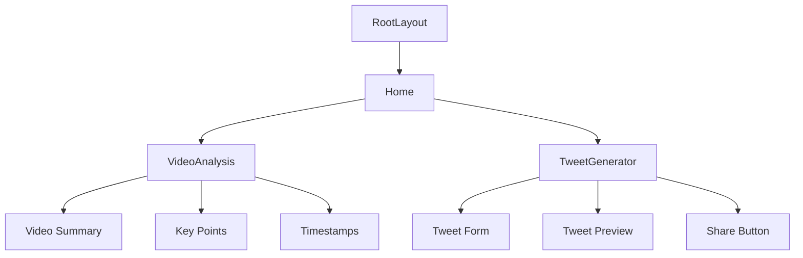

# Youtube Content'R'Us Converter

# 🎥 Youtube Content'R'Us Converter

Turn boring YouTube videos into spicy social content! This app helps content creators analyze videos and generate engaging tweets faster than you can say "like and subscribe!"

## 🚀 Features

- 🎯 Video Analysis: Get detailed summaries, key points, and important timestamps
- 🐦 Tweet Generator: Create viral-worthy tweets with AI-powered suggestions
- 📸 Thumbnail Integration: Automatically includes video thumbnails in your tweets
- 🌈 Dark Mode Support: Easy on the eyes, just like your favorite YouTube dark theme

## 🛠️ Tech Stack

- **Frontend**: 
  - Next.js 15.2 (Canary)
  - React 19
  - TailwindCSS 4
  - Geist Font Family

- **Backend**:
  - Supabase for data storage
  - OpenAI GPT-4 for content generation
  - Server-Side API Routes

- **Infrastructure**:
  - TypeScript for type safety
  - ESLint for code quality
  - Turbopack for fast builds

## 🌳 Component Tree



## 🗄️ Database Schema

The app uses Supabase with three main tables:
- `youtube_table`: Stores video metadata
- `segments`: Contains video segments with timestamps
- `transcripts`: Stores video transcriptions

## 🚦 Getting Started

1. Clone the repo
2. Install dependencies:

```bash
bun install
```

3. Create a `.env` file in the root directory:

```bash
NEXT_PUBLIC_SUPABASE_URL=your_supabase_url
NEXT_PUBLIC_SUPABASE_ANON_KEY=your_supabase_key
OPENAI_API_KEY=your_openai_key
```